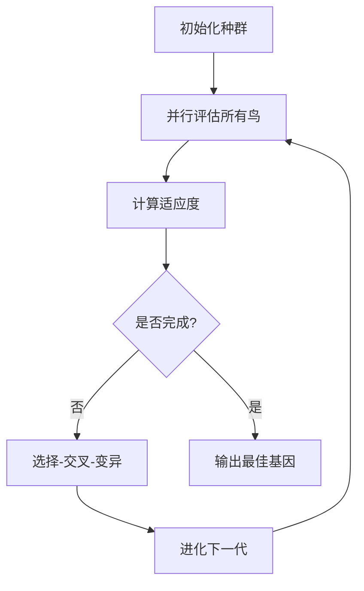

# Flappy Bird AI (神经进化算法)

使用 NEAT (NeuroEvolution of Augmenting Topologies) 算法，通过进化神经网络让 AI 学习如何控制小鸟避开管道！

## 📁 目录结构
- `flappy_bird_ai.py`: 核心游戏逻辑与 AI 训练代码
- `config-feedforward.txt`: NEAT 算法配置文件

## 🕹️ 运行方式
```bash
python flappy_bird_ai.py
```

你会看到多只小鸟同时在屏幕上飞行，这代表 NEAT 种群中的不同个体。表现最好的个体会保留下来进行下一代的进化！


## 🧠 核心逻辑详解

### 1. 游戏组件
程序包含以下核心类：
- **`Bird`**: 鸟的物理行为（移动、跳跃、绘制）
- **`Pipe`**: 管道的生成、移动和碰撞检测
- **`Base`**: 地面滚动动画

### 2. NEAT 训练流程


### 3. 神经网络输入与输出
**输入节点 (3个):**
1. 鸟的当前 y 坐标
2. 鸟的 y 坐标与管道顶部的距离
3. 鸟的 y 坐标与管道底部的距离

**输出节点 (1个):**
- 当输出值 > 0.5 时，小鸟执行跳跃动作

### 4. 适应度函数 (Fitness)
- **存活奖励**: 每帧 +0.1（鼓励活得久）
- **通过管道**: 每过一个管道 +5（主要奖励机制）
- **碰撞惩罚**: 撞管道或上下边界 -1

## ⚙️ NEAT 配置文件详解

### [NEAT] - 算法全局设置
- `fitness_criterion = max`: 最大化适应度
- `fitness_threshold = 100`: 达到100分即可结束训练
- `pop_size = 50`: 每代种群中有50只鸟（50个神经网络）
- `reset_on_extinction = False`: 物种灭绝后不重置训练

### [DefaultGenome] - 基因组（神经网络）配置
- **节点激活**: 双曲正切函数 (`tanh`)
- **连接权重**: 初始均值 0，标准差 1.0
- **连接突变率**: 80% 权重突变，20% 节点增删
- **网络参数**: 3 输入节点, 0 隐藏节点, 1 输出节点
  - `num_hidden = 0`: 从最简单的网络开始进化，自动增加复杂度
  - `feed_forward = True`: 前馈神经网络（无循环）

### [DefaultSpeciesSet] - 物种划分
- `compatibility_threshold = 3.0`: 基因差异 >3.0 时划分为不同物种，鼓励多样性

### [DefaultStagnation] - 物种停滞处理
- `max_stagnation = 20`: 物种 20 代没有改进就淘汰
- `species_elitism = 2`: 保留每个物种中最好的2个个体

### [DefaultReproduction] - 繁殖策略
- `elitism = 2`: 直接保留每代最好的2个基因
- `survival_threshold = 0.2`: 只允许适应度前 20% 的个体繁殖

## 📊 训练过程
1. **第 0 代**: 50只鸟都是随机策略，表现很差
2. **第 5-10 代**: 有些鸟能避开1-2个管道
3. **第 20-30 代**: 一些表现优秀的策略出现
4. **第 50 代**: 通常能训练出表现稳定的 AI

## 🎨 界面说明
- **左上角**: 当前世代数 (Gen: X)
- **右上角**: 当前分数 (Score: X)
- **黄色小鸟**: AI 控制的个体

## 📦 依赖安装
```bash
pip install pygame-ce neat-python
```
（`pygame-ce` 是 pygame 的社区版，对新版 Python 和 macOS 支持更好）
